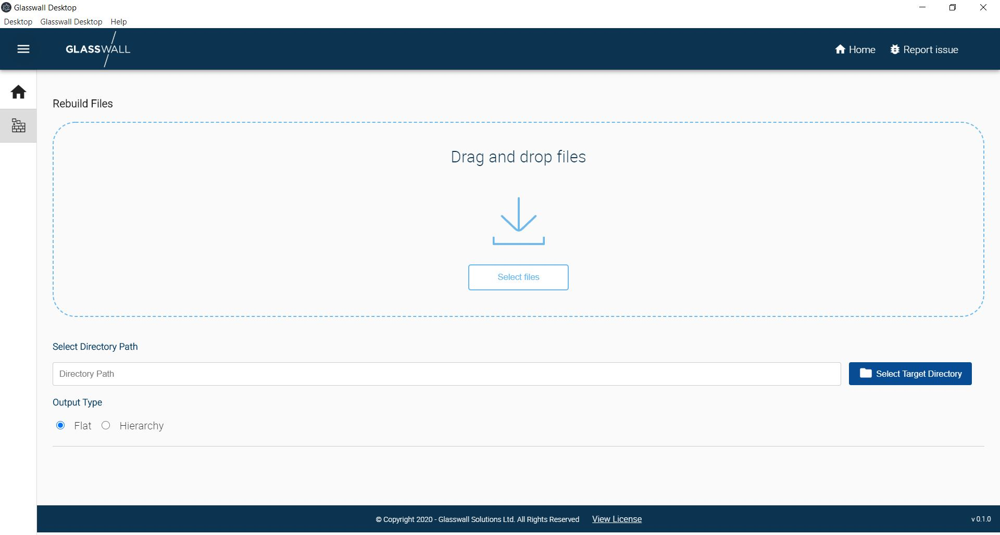
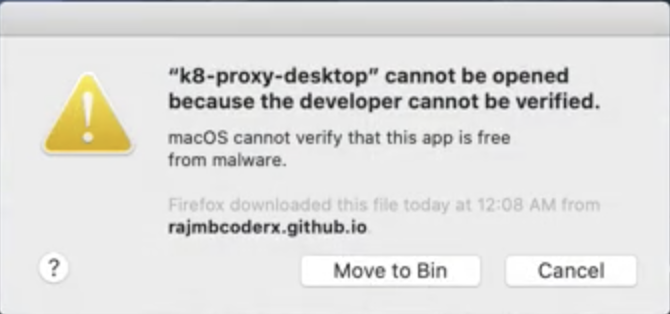
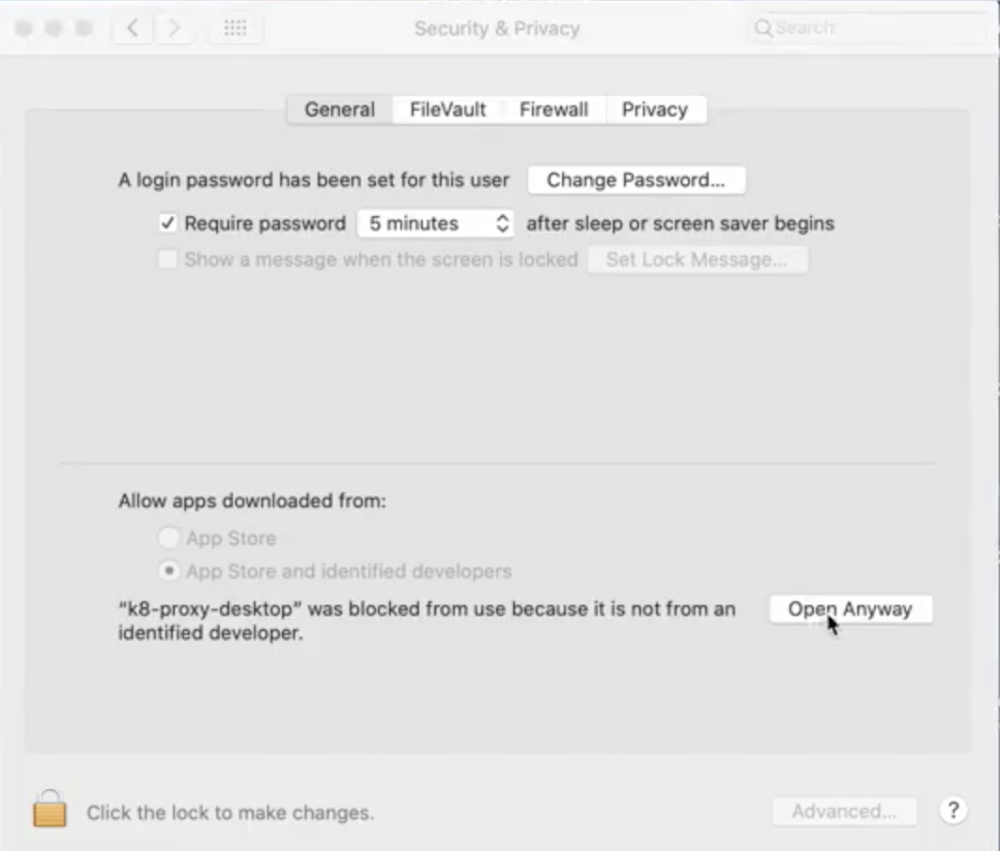
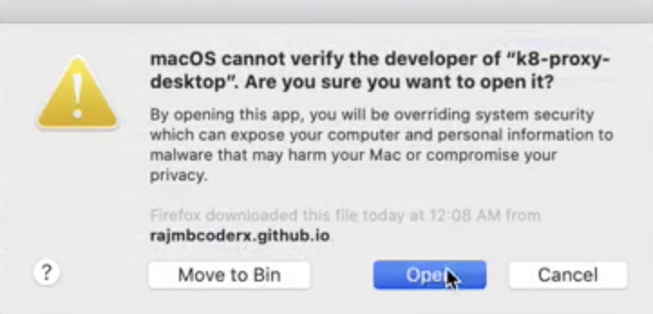
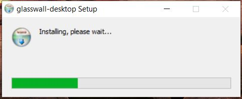
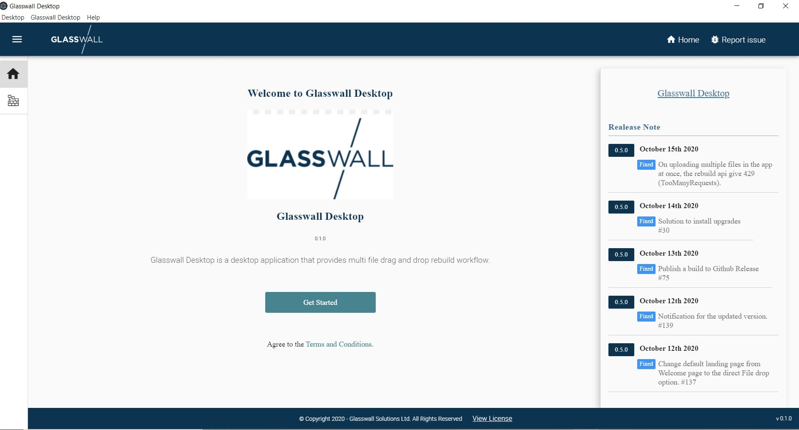

# Glasswall desktop

Glasswall Desktop is a desktop application that provides multi file drag and drop rebuild workflow.

## Membership

| Avatar | Name | Role | Time Zone |
| -------------------------------------------|----------------------|----------------------------| -------- |
|   | Virendra Vaishnav [@b24repo](https://github.com/b24repo) | Delivery Manager | IST |
|   | Sanchit Garg [@rajmbcoderx](https://github.com/rajmbcoderx) | Member | IST |
|   | Mudit Gupta [@gmuditdce](https://github.com/gmuditdce) | Member | IST |
|   | Sudhidh Kumar [@kumarsudhish](https://github.com/kumarsudhish) | Member | IST |
| 

## Current Objective and Key Results
**Objective:**

# [glasswall-desktop](https://k8-proxy.github.io/glasswall-desktop/)

**Key Results:**
1. Build with <a href="https://github.com/electron/electron"> Electron</a> , react, it is aimed at providing multi file drag and drop rebuild workflow.
2. It is a standalone application for MacOS, Windows and Linux operating systems.

<h2> How to setup</h2> 
<li> Clone the repo</li>
<li> Run<i> npm install</i>. This will install required packages for this project </li>

<h2> How to run</h2> 
<li> <i>npm run build</i> //build is requried to compile typescript</li> 
<li> <i>npm run start </i></li>

<h2> How to create distribution packages</h2> 
<li> <i>npm run dist</i> // build binaries/exe to Mac, Windows, Linux platforms in the dist folder. </li>

## Important links

If you are working on this project via Upwork, see also our [Upwork Rules of Engagement](https://github.com/filetrust/Open-Source/blob/master/upwork/rules-of-engagement.md)
If you are newcomer, then please check [Glasswall newcomers checklist ](https://github.com/filetrust/Open-Source )

## Installing

Warning: This software is under active development. Use at your own risk.

### macOS

Download the latest [glasswall-desktop release](https://github.com/k8-proxy/glasswall-desktop/releases/download/0.1.0/glasswall-desktop.dmg).

Mac users will need to follow the below steps on the app when you first launch it, until we have [code signing](https://www.electron.build/code-signing) set up

Step 1

  

Step 2

Step 3

TBD: Will automatically update when a new release is available.

### Windows

Download the latest [glasswall-desktop relase](https://github.com/k8-proxy/glasswall-desktop/releases/download/v0.1.0/glasswall-desktop-Setup-0.1.0.exe)

Windows users will need to follow the below steps on the app when you first launch it.

Step 1

Download the package from the above link, observe that .exe executable would be downloaded, glasswall-desktop-Setup-0.1.0.exe.

Step 2

Once executable has been downloaded, double click on the .exe and observe that installation starts.

Step 3

Observe that once the installation is complete, app is launched successfully showcasing the Welcome page

Step 4

Click on Get Started to navigate to the Rebuild Files page.

### Linux Snap

Glasswall desktop is only available for 64-bit Linux systems.
Download the latest [glasswall-desktop relase](https://github.com/k8-proxy/glasswall-desktop/releases/download/v0.1.0/glasswall-desktop-Setup-0.1.0.snap)

Linux/Ubuntu users will need to follow the below steps on the app when you first launch it.

Step 1

Install the snapd package if not present in the linux/ubuntu version you are using.

Step 2

Once snapd package has been installed verify it has been installed successfully by running below command.

Step 3

Unzip the downloaded desktop package and move inside the directory. And run below command to install the package

Step 4

Run below command to launch the desktop application

### Installing from source

1. Clone the repo
2. Open the command prompt (On windows) and terminal on (Ubuntu/Linux/MAC)
3. Run `npm  install`
4. `npm run build`
5. `npm run start`

## Building

### IDE 
To configure the codebase clone or download the codebase from the git and install the [Visual Stuido Code](https://code.visualstudio.com/)

### Importing Project in Visual Studio Code
1. Click on File in the Visul Studio tool bar.
2. Select Open Folder option.
3. Select the cloned glasswall-desktop folder.
4. Observe that Project has been imported.

## Debugging
Please change DEBUG variable to true and restart the app to start the electron debugger for code debugging purposes
[In this file](img/Debugger.JPG)

## Open Issues Highlishts
<li> Actual Desktop app video to be embedded in the web portal</li>
<li> Browse Output Folder button not working on MAC Desktop App</li>
<li> Browse button not working on MAC Desktop App</li>
<li> Rebuild App: Signed build needs to be created for rebuild desktop app</li>
Complete list of open issue can be found there [Glasswall Desktop Open Issues](https://github.com/k8-proxy/glasswall-desktop/deployments/activity_log#workspaces/glasswall-desktop-5f8d313208783c0012d1b601/board?labels=bug&repos=304378562)

